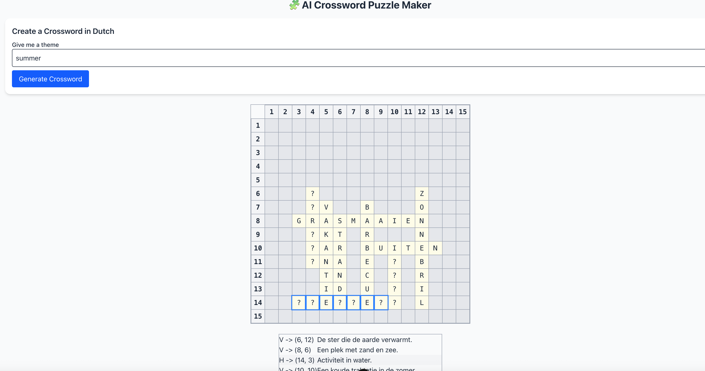

# Crossword‑AI 🔤

A simple project to generate crossword puzzles using AI.

- Python backend (FastAPI)
- Vue 3 frontend
- Language: Dutch (a language I am learning :) )
- Uses the OpenAI API to generate word lists and clues

---

## Table of Contents

- [Features](#features)
- [Demo / Screenshot](#demo--screenshot)
- [Prerequisites](#prerequisites)
- [Installation](#installation)
    - [Backend](#backend)
    - [Frontend](#frontend)
- [Usage](#usage)
- [Project Structure](#project‑structure)
- [How it works](#how‑it‑works)
- [Contributing](#contributing)
- [License](#license)
- [Acknowledgements](#acknowledgements)

---

## Features

- Generates a crossword grid and clues automatically using the OpenAI API.
- Frontend grid allows users to hover over clues, reveal letters, and interactively solve.
- Built with modern tools: FastAPI on the backend, Vue 3 on the frontend.
- Designed as a learning‑project: AI prompting, API integration, algorithmic crossword placement.

---

## Demo / Screenshot

  
_Example of the generated crossword grid and clue table._

---

## Prerequisites

### Backend
- Python 3.9 or later
- A valid [OpenAI API key](https://platform.openai.com/account/api‑keys). Set as environment variable `OPENAI_API_KEY`.
- Recommended: create and activate a virtual environment (venv / conda).

### Frontend
- Node.js 16 or later
- npm or yarn
- A modern browser (Chrome, Edge, Firefox, Safari)

---

## Installation

### Backend
The backend runs by default at http://127.0.0.1:8000.
```bash
cd backend/
# (optional) set up virtual env
python -m venv .venv
source .venv/bin/activate   # macOS/Linux
.\.venv\Scripts\activate    # Windows

pip install --upgrade pip
pip install -r requirements.txt

# Ensure environment variable is set:
export OPENAI_API_KEY="your_api_key_here"    # macOS/Linux
set OPENAI_API_KEY="your_api_key_here"       # Windows

uvicorn main:app --reload

```


#### Available endpoints:

POST /generate — generate a new crossword (words + clues)

### Frontend
The frontend development server runs (by default) at http://localhost:5173 (or similar).

````
cd ai‑crossword‑frontend/
npm install           # or yarn install
npm run dev           # or yarn dev
````


You may need to update the API base URL in the .env or configuration file if your backend is on a different origin.

## Usage

- Start the backend server (see instructions above).

- Start the frontend server.

- In the frontend, generate a new puzzle (there may be a “Generate” button).

- The grid and clues will appear.

- Hover over a clue → the corresponding word’s cells are highlighted.

- Click on a clue → the letters of that word are revealed (initially shown as ?).

- Solve the puzzle manually, or use the project as a learning tool / demo.

## Project Structure
```
/ (root)
│ README.md
│ screenshot.png
│ backend/
│   └ main.py           # FastAPI app
│   └ solver.py         # Crossword generation algorithm
│   └ requirements.txt
│ frontend/
└ ai‑crossword‑frontend/  # Vue 3 app folder
```

- backend/ — Python code for generation + API.

- ai-crossword-frontend/ — Vue 3 app that displays the crossword and handles interactions.

## How it works
- The backend uses a simple heuristic algorithm to place words in a grid (longest first, maximize intersections, fallback random placement).

- It uses the OpenAI API to supply the word list and clues for the crossword.

- The frontend renders the grid and clue table, and supports user interactions (hover, click to reveal).

- Words are initially hidden (?) and only revealed when the user clicks the corresponding clue.

- Hovering a clue highlights the corresponding cells.

## Contributing

Contributions are welcome!

If you’d like to contribute:

 - Fork the repository.

- Create a new branch (git checkout -b feature‑yourFeature).

- Make your changes and commit (git commit ‑m 'Add new feature').

- Push to your branch (git push origin feature‑yourFeature).

- Open a Pull Request and describe your changes.

- Please ensure you follow the coding style and write clear commit messages.

## License
TBD

## Acknowledgements

Developed by Amanda M. Lins.

Initially scaffolded using ChatGPT for prompting and debugging.

Built using FastAPI and Vue 3

Thanks to the open‑source community for inspiration and libraries.